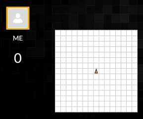
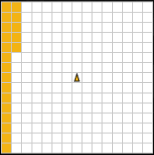
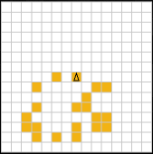

# CodinGame "Langton's Ant" Walkthrough

```javascript
const d = parseInt(readline()); // Dimension of the square grid
const n = parseInt(readline()); // Number of squares each player can select
const p = parseInt(readline()); // Length of the ant's path

// game loop
while (true) {
    const inputs = readline().split(' ');
    const ox = parseInt(inputs[0]); // The coordinates of your opponent's last move
    const oy = parseInt(inputs[1]);

    console.log(0, 0);     // <row> <column>
}
```



```javascript
let i = 0;
while (true) {
    const inputs = readline().split(' ');
    const ox = parseInt(inputs[0]); // The coordinates of your opponent's last move
    const oy = parseInt(inputs[1]);

    // When i === d : change column
    console.log(i%d, Math.floor(i/d));
    i++;
}
```



**14x14 score : 37**

```javascript
// Create a d*d map filled with 0
const newmap = () => new Array(d).fill(0).map(u => new Array(d).fill(0));
// Clone a map (changing the output will not change the source)
const clonemap = (map) => new Array(d).fill(0).map((u1, x) => map[x].slice(0));
// Center of the map
const c = Math.floor(d / 2);
```

```javascript
// Return the moves available in the ant's path
const predict = (map) => {
    let cx = c; // Position
    let cy = c;
    let dx = -1; //Direction
    let dy = 0;
    const tmap = clonemap(map);
    const moves = new Array(p);
    let score = n; // The ant starts with n tiles in the map
    let k;
    for (k = 0; k < p; k++) {
        if (tmap[cx][cy] > 0) { // When there is something, go left and empty the cell
            const tmp = dx;
            dx = -dy;
            dy = tmp;
            tmap[cx][cy] = 0;
            score--;
        } else { // When cell's empty, go right and fill it
            const tmp = dy;
            dy = -dx;
            dx = tmp;
            tmap[cx][cy] = 1;
            score++;
        }
        moves[k] = {
            x: cx,
            y: cy,
            score: score,
            available: !map[cx][cy] // If cell's empty in the original map, add as possiblity
        };
        // If there isn't a wall, go to next cell
        if (cx + dx >= 0 && cx + dx < d && cy + dy >= 0 && cy + dy < d) {
            cx += dx;
            cy += dy;
        } else {
            break;
        }
    }
    // Fill the end of the array when a wall was hit
    for (k = k + 1; k < p; k++) {
        moves[k] = {
            x: cx,
            y: cy,
            score: score,
            available: false
        };
    }
    return moves;
};
```

```javascript
// Get the best move possible
const getBest = (map) => {
    let maxScore;
    let bestMove;
    const possible = predict(map).filter(move => move.available);
    const done = [];
    possible.forEach((move) => {
        if (!done.includes(move.x + ' ' + move.y)) {
            map[move.x][move.y] = 1; // Temporary move
            const subMoves = predict(map); // Get new prediction
            map[move.x][move.y] = 0; // Clean temporary move
            const score = subMoves[p - 1].score; // Get final score
            if (!maxScore || score > maxScore) {
                maxScore = score;
                bestMove = move;
            }
            done.push(move.x + ' ' + move.y);
        }
    });
    return bestMove;
};
```

```javascript
const map = newmap();
while (true) {
    const inputs = readline().split(' ');
    const ox = parseInt(inputs[0]); // The coordinates of your opponent's last move
    const oy = parseInt(inputs[1]);

    const move = getBest(map);

    map[move.x][move.y] = 1;
    console.log(move.x, move.y);
}
```



**14x14 score : 49 (32% increase)**