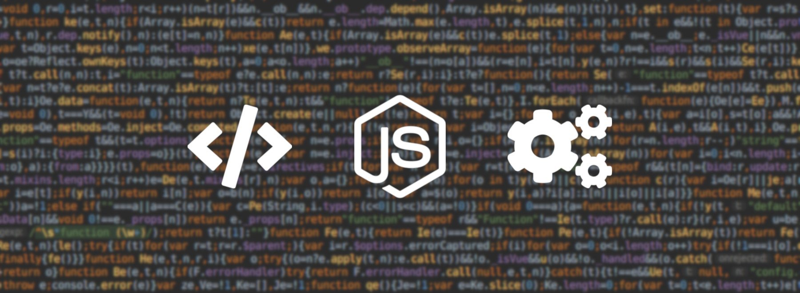

# How to create a (slow) interpreter - Introduction


*Vue.js minified code highlight on Webstorm*

Have you ever considered creating your own language ? With its own features and syntax ? If the answer is yes, maybe you should read another article where you can learn an efficient way of doing so. If you're here by curiosity, tighten your seatbelt and fetch a drink, we're going on a ride.

## How I got here

Several months ago, I was on this project named **Red Pineapple** with some friends where we had to make a choice between these 3 options:
* Make a full [scratch-like interface](https://en.wikipedia.org/wiki/Scratch_(programming_language)) to allow programming with building blocks.
* Allow users to use a known language with its own potential backdoors that could threaten our server.
* Create our own limited but complete language.

The third option was the one that we eventually chose as we had the motivation and the energy to complete it in 4 to 5 months. The goal was to generate math problems from templates written by teachers in a *not so complicated* language.

Back then, we didn't know there were tools to perform that task from your own design and choices, but we were young and ignorant (we still are by the way) and nothing is more formative than doing it from scratch (keep repeating that to reassure your manager, 100% success rate).

I took this task myself to let others handle front-end and back-end development of our service and because I was also eager to create something of my own. After some months, here is what this language was capable of:
* Variable attributions, conditions, loops
* Formal expression computing and common math functions with [Giac/Xcas](https://www-fourier.ujf-grenoble.fr/~parisse/giac.html)
* LaTeX expression output with variable injection
* Custom ternary inside output
* Matrix creation and handling (indices, vectors, other stuff)
* Seeded random functions

You can see the working interpreter on GitHub: [Red-Juice](https://github.com/Klemek/Red-Juice).

I discovered a lot of things during this project and I wanted to take this opportunity to discuss it with anyone interested.

We will be creating during this blog post a small but efficient interpreter for a language with a minimal syntax.
It will be close to the one mentioned before, but with far less features for the post simplicity.

## First step, syntax

Ok, first things first, we will be working on an interpreted language, not a compiled one. The difference is simple: **we don't need to create a bytecode to be read by the computer**. In fact, it will be as simple as reading it from a human perspective: a cursor will jump along the lines and decide where to go next while a memory will retain variables known during the execution. There will be 2 major steps:

* Error detection
* Execution (if the last step was successful)

By doing so, we don't need to deal with the ulgy task of throwing and handling exceptions.

Looks like it's time to make some choices. For simplicity, we will impose the following:
* Each line is a single code statement: no semi-colon for delimiting (like python)
* The indentation will have no impact apart from readability (unlike python)
* Variable assignment and modification: `VAR` keyword
* Conditions: `IF`, `ELSEIF`, `ELSE` and `ENDIF` keywords
* Loops: `WHILE` and `ENDWHILE` keywords
* Output: `PRINT` keyword with brackets for formatting

<details><summary>To summarize (click)</summary><p>

The following code:

```
VAR A = 169
VAR B = 585
PRINT GCD({A}, {B})
VAR D = 0
WHILE A != B
    IF A > B
        VAR A = A - B
    ELSE
        VAR B = B - A
    ENDIF
    PRINT = GCD({A}, {B})
ENDWHILE
PRINT = {A}
```

Will output:

```
GCD(169, 585)
= GCD(169, 416)
= GCD(169, 247)
...
= GCD(13, 26)
= GCD(13, 13)
= 13
```

</p></details>

I think we're good to go.

See you next time for __How to create a (slow) interpreter - Part 1: Tokens__ (soon).
