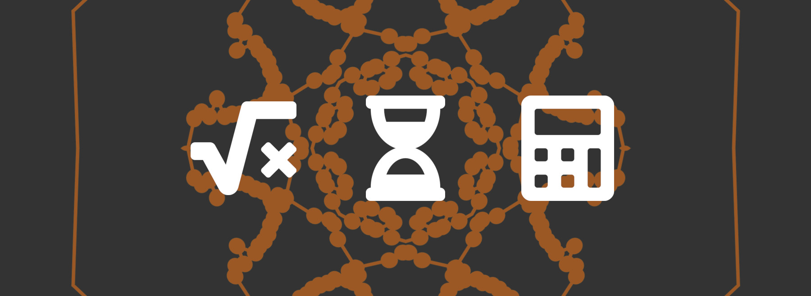
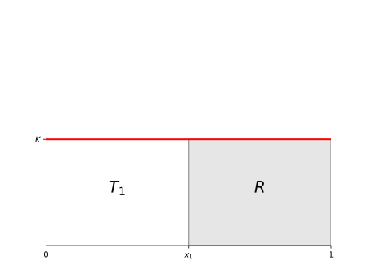
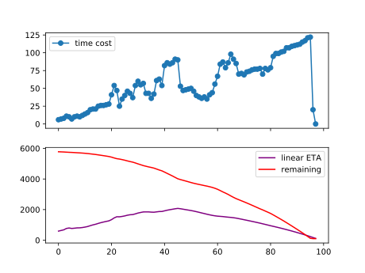
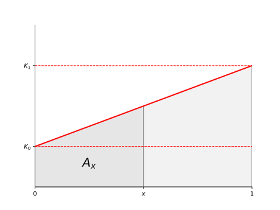
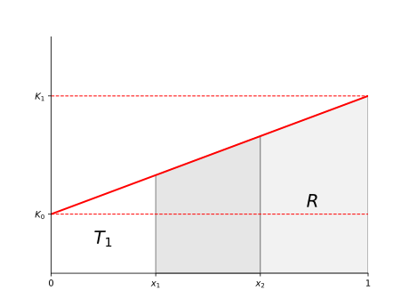
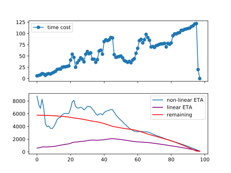

# Should I go take my coffee now?



```
Computing data...
```

Sometimes, as you launch a script, your eyes dive into these 3 final dots on the screen meaning the task will take a while.

```
Computing data...
```

As the time pass, you wonder if you might kill your function to add a remaining time indicator (or ETA: Estimated Time of Arrival) or keep waiting until, in an undetermined amount of time, it ends.

---

Coffee meter for the next parts:  
<i class="fa-2x fas fa-coffee"></i><i class="fa-2x fas fa-coffee"></i><i class="fa-2x fas fa-coffee"></i>

---

So you get back to your desk, coffee in hand to see the result you seek and... 

```
Computing data...
```

As you kill this annoying task you ask yourself what's a simple way to get the ETA.

## Linear progress ETA

In this case, making n% will always take the same amount of time.

Let's represent the time-cost like this:
* horizontal axis is the progress between 0 and 1
* vertical axis is the time cost



We know the time taken at a given progress: $x_{1},T_{1}$  
And we want to get the remaining time: $R$

$$T_{1}=x_{1}K\Leftrightarrow K=\frac{T_{1}}{x_{1}}$$

$$R = (1-x_{1})K$$

$$\color{Red}{R=(1-x_{1})\frac{T_{1}}{x_{1}}}$$

---

You quickly implement this function in your code and launch it again.

```
Computing data...
Computing data... (ETA: 20 s)
Computing data... (ETA: 1 min)
Computing data... (ETA: 3 min)
Computing data... (ETA: 10 min)  
```

You kill it again, there must be a mistake somewhere... but you find nothing.

You understand quickly that, as the percentage goes, the time it takes increase as well like this:

  
*The vertical scale is in seconds here...*

As you can see, the simple time indicator wasn't enough for this task.

First, we need to acknowledge the shape of the time-cost function: a trapezoid.

## Area of a trapezoid function



It's a simple function like: $f(x)=ax+b$  
But we need to calculate its area.

$$\left\{\begin{matrix}
x=0\Leftrightarrow y=K_{0}
\\x=1\Leftrightarrow y=K_{1}
\end{matrix}\right.$$

$$y=K_{0}+(K_{1}-K_{0})x=K_{0}+\Delta Kx$$

$$A_{x}=\int_{0}^{x}(K_{0}+\Delta Kx)dx$$

$$\color{Red}{A_{x}=K_{0}x+\frac{\Delta K}{2}x^{2}}$$

---

We can apply this formula to the known cases:

$$\left\{\begin{matrix}
A_{0}=0
\\A_{1}=K_{0}+\frac{\Delta K}{2}
\end{matrix}\right.$$

Now we can use this formula to get what we want.

## Non-linear progress ETA

This time, a progress of n% will take more time over time.



We know the time taken at 2 given progresses: $x_{1},T_{1},x_{2},T_{2}$  
And we still want to get the remaining time: $R$

$$\left\{\begin{matrix}
1:T_{1}=A_{x_{1}}=K_{0}x_{1}+\frac{\Delta K}{2}x_{1}^{2}
\\2:T_{2}=A_{x_{2}}=K_{0}x_{2}+\frac{\Delta K}{2}x_{2}^{2}
\end{matrix}\right.$$

$$1:K_{0}=\frac{1}{x_{1}}(T_{1}-\frac{\Delta K}{2}x_{1}^{2})$$

$$\color{Red}{K_{0}=\frac{T_{1}}{x_{1}}-\frac{\Delta K}{2}x_{1}}$$

$$2:T_{2}=(\frac{T_{1}}{x_{1}}-\frac{\Delta K}{2}x_{1})x_{2}+\frac{\Delta K}{2}x_{2}^{2}$$

$$T_{2}=T_{1}\frac{x_{2}}{x_{1}}-\frac{\Delta K}{2}x_{1}x_{2}+\frac{\Delta K}{2}x_{2}^{2}$$

$$T_{2}=T_{1}\frac{x_{2}}{x_{1}}+\frac{\Delta K}{2}x_{2}(x_{2}-x_{1})$$

$$\frac{\Delta K}{2}=\frac{T_{2}-T_{1}\frac{x_{2}}{x_{1}}}{x_{2}(x_{2}-x_{1})}\color{Blue}{=\frac{\frac{T_{2}}{x_{2}}-\frac{T_{1}}{x_{1}}}{x_{2}-x_{1}}}$$

$$\color{Red}{\frac{\Delta K}{2}=\frac{T_{2}}{x_{2}(x_{2}-x_{1})}-\frac{T_{1}}{x_{1}(x_{2}-x_{1})}}$$

$$R=A_{1}-T_{2}=K_{0}+\frac{\Delta K}{2}-(K_{0}x_{2}+\frac{\Delta K}{2}x_{2}^{2})$$

$$R=K_{0}(1-x_{2})+\frac{\Delta K}{2}(1-x_{2}^{2})$$

We can now calculate our remaining time by calculating the intermediate values of $K_{0}$ and $\Delta K$ but we can also get rid of the first one.

<details><summary>Steps to simplify further the formula (click)</summary><p>

$$R=(\frac{T_{1}}{x_{1}}-\frac{\Delta K}{2}x_{1})(1-x_{2})+\frac{\Delta K}{2}(1-x_{2}^{2})$$

$$R=\frac{T_{1}}{x_{1}}(1-x_{2})-\frac{\Delta K}{2}x_{1}(1-x_{2})+\frac{\Delta K}{2}(1-x_{2})(1+x_{2})$$

$$R=(1-x_{2})(\frac{T_{1}}{x_{1}}+\frac{\Delta K}{2}(1+x_{2}-x{1}))$$

$$R=(1-x_{2})(\frac{T_{1}}{x_{1}}+\color{Blue}{\frac{\frac{T_{2}}{x_{2}}-\frac{T_{1}}{x_{1}}}{x_{2}-x_{1}}}(1+x_{2}-x{1}))$$

$$R=(1-x_{2})(\frac{T_{1}}{x_{1}}(1-\frac{1+x_{2}-x_{1}}{x_{2}-x_{1}})+\frac{T_{2}}{x_{2}}\frac{1+x_{2}-x{1}}{x_{2}-x_{1}})$$

$$R=(1-x_{2})(\frac{T_{2}}{x_{2}}(1+\frac{1}{x_{2}-x_{1}})-\frac{T_{1}}{x_{1}}\frac{1}{x_{2}-x_{1}})$$

$$R=(1-x_{2})(\frac{T_{2}}{x_{2}}+\color{Blue}{\frac{\frac{T_{2}}{x_{2}}-\frac{T_{1}}{x_{1}}}{x_{2}-x_{1}}})$$

</p></details>

$$\color{Red}{R=(1-x_{2})(\frac{T_{2}}{x_{2}}+\frac{\Delta K}{2})}$$

---

Let's verify that it's working for the simple case we saw before.

$$K_{0}=K_{1}\Leftrightarrow \Delta K=0$$

$$\color{DarkGreen}{R=(1-x_{2})\frac{T_{2}}{x_{2}}}$$

## Real data

> On real data, we have more than 2 points so how do we get the ETA from a set of points?

You can use this formula as you want, but to get results quickly, you can get the mean of values calculated between the last point and every other point. Described like this ($k$ being the index of the last point):

$$\mu =\frac{\sum_{i=0}^{k-1} \Delta K_{x_{i},x_{k}}}{2(k-1)}$$

$$R=(1-x_{2})(\frac{T_{2}}{x_{2}}+\mu)$$

It will give you something like this:



At the beginning, there will be a lot of variations but it will soon get close to the real remaining time.

Here's the final formula one more time:

$$\left\{\begin{matrix}
\frac{\Delta K}{2}=\frac{T_{2}}{x_{2}(x_{2}-x_{1})}-\frac{T_{1}}{x_{1}(x_{2}-x_{1})}
\\R=(1-x_{2})(\frac{T_{2}}{x_{2}}+\frac{\Delta K}{2})
\end{matrix}\right.$$

With this tool, you can gauge at the logs and finally tell "now's the time to get a coffee!"

---


